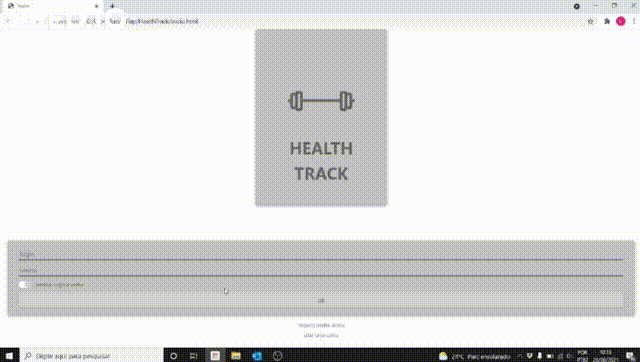
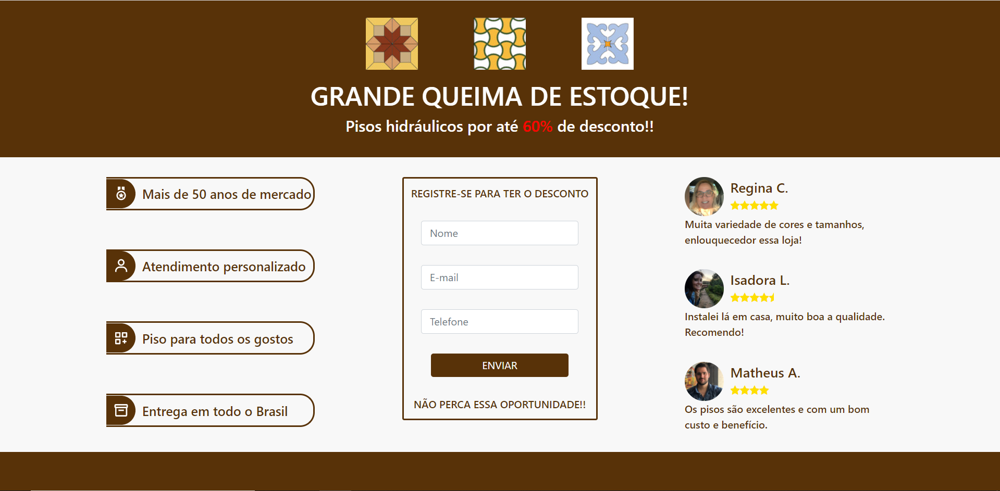

# Olá, Sou Lucas Amorim 👋

  <a href="https://www.fatorialinvest.com.br/" target="_blank"> </img></a>
  <a href="https://www.linkedin.com/in/amorim-22-lucas/" target="_blank"></img></a>
  <a href="https://api.whatsapp.com/send?phone=5521988611540" target="_blank"></img></a>

 

  

<h3>Linguagens:  
 
 
</h3>

<h3>Frontend:  
 
 
  
</h3>

<h3>Backend:  
</h3>

<h3>Database:  
</h3>

<h3>Versionamento:  
   
</h3>

<h3>Hosting:  
</h3>

<h3>Outros:  
</h3>

<h3>Projetos Desenvolvidos</h3>

<h4>HEALTHTRACK</h4>
Projetos que tenho desenvolvido para fins acadêmicos para a Faculdade FIAP. Inicialmente uma aplicação que tem como objetivo monitorar e registrar a pesagem de usuários.
  
<ul>
  <li><b>Health Track Modelo FrontEnd simples:</b>   Elaborei uma estrutura visual inicial da aplicação utilizando HTML e CSS com bootstrap</li> 
  </img>  
  Para maiores informações sobre o repositório <a href="https://github.com/Amorim-cyber/HealthTrack" target="_blank">clique aqui</a> 😄  
  <li><b>Health Track Angular:</b>   Adaptei o Health Track Modelo FrontEnd simples para o framework Angular</li> 
  <a href="https://amorim-cyber.github.io/HealthTrackAngular/" target="_blank">Visualize aqui</a> a página 📄 
  <a href="https://github.com/Amorim-cyber/HealthTrackAngular" target="_blank">Visualize aqui</a> o projeto ⚡  
  <li><b>Health Track Modelo Java:</b>   Busquei me desafiar replicando as funcionalidades do HealthTrack utilizando a linguagem java</li> 
  </img>  
  <a href="https://github.com/Amorim-cyber/HealthTrackJava" target="_blank">Clique aqui</a> para conhecer mais 😄  
  <li><b>Health Track Metodo getAll():</b>   Testando o método getAll() que retorna informações sobre atividades físicas</li> 
  </img>  
  Confira <a href="https://github.com/Amorim-cyber/HealthTrackGetAll" target="_blank">aqui</a> o projeto 😉  
  
</ul>

<h4>SMASH BANK</h4>
Projeto que simula registro e monitoramento de ofertas publicas de uma instituição financeira fictícia. Utilizei java spring boot / angular / banco de dados relacional cloud Heroku
  
</img> 
<a href="https://amorim-cyber.github.io/Frontend-PublicOffer-testmode/main" target="_blank">Visualize aqui</a> a página 📄 
<a href="https://github.com/Amorim-cyber/Frontend-PublicOffer-testmode" target="_blank">Visualize aqui</a> o projeto ⚡ 
<b>OBS: </b> A página pode demorar um pouco a carregar  

<h4>TILE PAGES</h4>
Projetos desenvolvidos com o intuito de simular um site de vendas de pisos hidráulicos
  
<ul>
  <li><b>Tile Landing Page:</b>   Elaborei uma Landing page promocional utilizando o Angular (página meramente estética)</li> 
  </img>  
  Para acessar a página <a href="https://amorim-cyber.github.io/TileLandingPage/PROMO%C3%87%C3%83O" target="_blank">clique aqui</a> 📄 
  Para maiores informações sobre o repositório <a href="https://github.com/Amorim-cyber/TileLandingPage" target="_blank">clique aqui</a> ⚡  
  
</ul>
<!--
**Amorim-cyber/Amorim-cyber** is a ✨ _special_ ✨ repository because its `README.md` (this file) appears on your GitHub profile.

Here are some ideas to get you started:

- 🔭 I’m currently working on ...
- 🌱 I’m currently learning ...
- 👯 I’m looking to collaborate on ...
- 🤔 I’m looking for help with ...
- 💬 Ask me about ...
- 📫 How to reach me: ...
- 😄 Pronouns: ...
- ⚡ Fun fact: ...
-->
